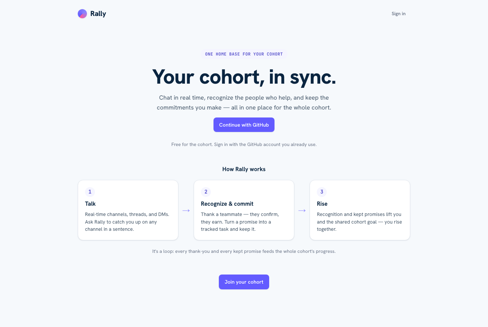

# Rally

**Your cohort, in sync.** A real-time comms platform where a cohort talks, recognizes the people who
help, and keeps the commitments they make — with a built-in assistant that can act on your behalf.

**▶ Live demo: [rally-nikjain15.vercel.app](https://rally-nikjain15.vercel.app)** — sign in with GitHub.



---

## What it is

At its base, Rally is a realtime chat app — **channels, DMs, threads, reactions, unread, search,
@mentions**. Layered on top are the things that make it more than chat, each of which **degrades to
nothing** if the model or GitHub is unavailable, so the core always works:

- **Recognition that can't be gamed.** Thank a teammate → Rally proposes a recognition → *they*
  confirm it → only then does the helper earn points. It rewards generosity, not who talks the most.
- **Commitments you keep.** "Track it" turns a promise ("I'll open the PR by Friday") into a GitHub
  issue; closing the issue marks the commitment kept and posts the status back to the thread.
- **A Rally assistant on Home.** A chat panel backed by a Claude tool-use loop with **persistent
  memory**. It reads your situation (catch-me-up, summarize a channel, list your commitments, find a
  teammate) and **drafts actions you confirm with one tap** — it never acts on its own, and it can
  never award points itself (a drafted recognition still gets peer-confirmed).
- **Quiet intelligences.** A "Catch me up" brief, an "Ask Rally" channel Q&A, and
  recognition/commitment detection. The word "AI" never appears in the UI — it's just *Rally*.

Rally is deliberately built to **lift, never punish**: opt-in peer-confirmed recognition, a
**neighbors-only** leaderboard (no public "who's behind"), a cooperative team goal, and no penalty
for a missed commitment.

## How it works

```
  Talk  ──▶  Recognize & commit  ──▶  Rise
   │              │                     │
   └── channels   └── peer-confirmed    └── recognition + kept promises lift
       threads        recognition           you and the shared cohort goal
       DMs            tracked commitments
```

Every thank-you and every kept promise feeds the whole cohort's progress. The assistant sits on top
of this loop and can drive any part of it for you (with your confirmation).

## Architecture

- **Next.js 16 (App Router) + React 19 + TypeScript + Tailwind v4.** Firestore is the realtime bus
  (`onSnapshot` — no custom websockets), Firebase Auth (GitHub) is identity, `firebase-admin` backs
  the server routes, and `@anthropic-ai/sdk` runs **server-side only**.
- **The model has no authority.** It classifies, summarizes, and drafts; it never writes a
  points-bearing row. Every intelligence — including the assistant — has a deterministic fallback,
  so Rally works fully with the model switched off.
- **Ledger, not counters.** Points/rank derive from the append-only `xpEvents` collection, written
  only by trusted server routes; rank is computed (query + reduce), never a stored total.
- **Security lives in `firestore.rules`.** Channel-membership isolation, authorship binding, and
  anti-gaming: clients can never mint points, confirm their own recognition, inflate a count with
  duplicate ids, react as someone else, or read another person's assistant conversation.

## Run it locally (no credentials needed)

Requires Node 20.9+ and Java on your PATH (the Firebase emulator needs it).

```bash
npm ci                 # @cohort/core is vendored + committed — no pre-build, no sibling needed
npm run build          # verified green from a fresh clone

# Two terminals for local dev on the emulator:
npm run emulator       # terminal 1 (Firestore + Auth emulators)
npm run dev:emulator   # terminal 2 → http://localhost:3000

# Optional: seed synthetic demo data
FIRESTORE_EMULATOR_HOST=127.0.0.1:8080 GCLOUD_PROJECT=demo-rally node scripts/seed.mjs
```

Sign in with GitHub (the emulator stands in for GitHub locally). Everything works with the model and
GitHub switched off — the live smart/PM features only need the env below.

## Testing

```bash
npm run gate           # typecheck · lint · unit · rules · integration · e2e smoke
npm run test:e2e       # signed-in browser e2e against the emulator
```

- **unit** — pure logic: detection, brief ranking, points, rate-limit, unread, @mention parsing,
  search, commitment nudges, assistant tool routing, model-output parsing.
- **rules** — the anti-gaming / membership / privacy guarantees (the load-bearing tests).
- **integration** — the real client SDK + rules + realtime on the emulator, including an adversarial
  "break it" pass, assistant memory persistence, and a cohort-scale perf pass (~65 users / ~2,100
  messages: channel load ~73ms, brief ~69ms, leaderboard ~16ms).
- **e2e** — signed-in browser flows: send, react, edit/delete, thread reactions, @mention (two
  clients), search, profile, onboarding, leaderboard opt-in, the assistant panel, and cross-client
  realtime.

## Project structure

```
app/            Next.js routes — pages (home, channels, quests, leaderboard, profile) + API routes
components/     UI — app shell, nav, the Rally assistant panel, onboarding
lib/            data layer, firestore rule helpers, the model wrapper, and the assistant tool loop
firestore.rules the security surface (rules-tested)
tests/          unit · rules · integration · e2e
```

## Environment (live deploy only)

`NEXT_PUBLIC_FIREBASE_*`, `FIREBASE_SERVICE_ACCOUNT`, `ANTHROPIC_API_KEY`, `GITHUB_TOKEN`,
`GITHUB_PM_REPO`, `GITHUB_WEBHOOK_SECRET`. All optional — the app runs deterministically without them.

## License

[MIT](LICENSE).
