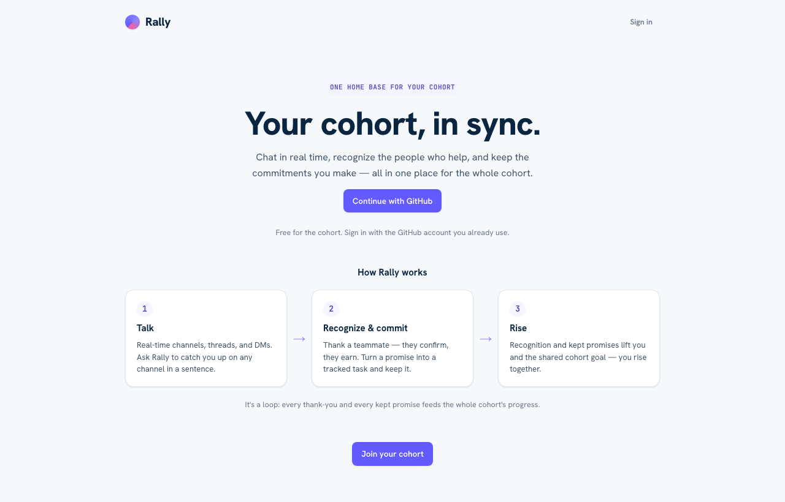

<p align="center">
  <a href="https://rally-nikjain15.vercel.app"></a>
</p>

<h1 align="center">Rally</h1>

<p align="center">
  <b>Team chat that actually builds the team: recognition, motivation, and follow-through, not just messages.</b>
</p>

<p align="center">
  <a href="https://github.com/nikjain15/rally/actions/workflows/ci.yml"></a>
  <a href="LICENSE"></a>
  
</p>

<p align="center">
  <a href="https://rally-nikjain15.vercel.app"><b>▶ Live demo</b></a> &nbsp;·&nbsp; sign in with GitHub &nbsp;·&nbsp; the same code you are reading here
</p>

<!-- DEMO_GIF -->

> **Status:** piloted with the cohort. Everything below describes what the code actually does; nothing is aspirational unless it says "roadmap".

---

Rally is a real-time comms platform where a team talks, recognizes the people who help, and keeps the
commitments they make, with a built-in assistant that drafts actions you confirm with one tap. It is
**AI-optional and trust-first**: every feature works with the model switched off, and the load-bearing
innovation is the trust layer, not the model.

## What it is

At its base, Rally is a realtime chat app: **channels, DMs, threads, reactions, unread, search,
@mentions**. Layered on top are the things that make it more than chat, each of which **degrades to
nothing** if the model or GitHub is unavailable, so the core always works:

- **Recognition that can't be gamed.** Thank a teammate, Rally proposes a recognition, *they* confirm
  it, and only then does the helper earn points. It rewards generosity, not who talks the most.
- **Commitments you keep.** "Track it" turns a promise ("I'll open the PR by Friday") into a GitHub
  issue; closing the issue marks the commitment kept and posts the status back to the thread.
- **A Rally assistant on Home.** A chat panel backed by a **bounded reason-act agent** (the vendored
  `@conduit/agent` loop) with **persistent memory** and intent-selected skills. It reads your situation
  (catch-me-up, summarize a channel, list your commitments, find a teammate) with **read-only** tools
  and **drafts actions you confirm with one tap**: it never acts on its own, and it can never award
  points itself (a drafted recognition still gets peer-confirmed).
- **Quiet intelligences.** A "Catch me up" brief, an "Ask Rally" channel Q&A, and
  recognition/commitment detection. The word "AI" never appears in the UI, it is just *Rally*.

Rally is deliberately built to **lift, never punish**: opt-in peer-confirmed recognition, a
**neighbors-only** leaderboard (no public "who's behind"), a cooperative team goal, and no penalty
for a missed commitment.

```
  Talk  ──▶  Recognize & commit  ──▶  Rise
   │              │                     │
   └── channels   └── peer-confirmed    └── recognition + kept promises lift
       threads        recognition           you and the shared team goal
       DMs            tracked commitments
```

## How the AI works

Every intelligence is low-stakes by construction, because the model has no authority. It classifies,
summarizes, and drafts; it never writes a points-bearing row, and each path has a deterministic
fallback, so Rally runs fully with the model switched off.

- **An ungameable, append-only points ledger.** Points and rank derive from the `xpEvents`
  collection, written only by trusted server routes and never mutated in place; rank is computed
  (query then reduce), never a stored total. **The AI has no authority** over it: the assistant loop
  runs with `allowSideEffects: false` and no points-writing tool, so a side-effecting call is refused
  by default (`lib/conduit/agent/loop.ts`).
- **A bounded @conduit/agent loop.** The Home assistant runs a small reason-act loop with a step
  budget, **runtime-selected skills** chosen by intent, and **read-only** tools. Propose-tools draft
  an action; the user confirms it. Refusals are fed back to the model as observations rather than
  thrown, so it can pick a read-only path.
- **A wired cost cascade.** Recognition detection is the bulk, low-stakes classify that runs on every
  posted message, so it routes to the cheap tier, `claude-haiku-4-5` (`MODELS.brief`). When a single
  message is genuinely ambiguous (a raw candidate below the confidence gate), Rally **auto-escalates
  that one message once** to `claude-opus-4-8` (`MODELS.escalate`) for a better judgment before it
  decides (`lib/detect-model.ts`). Both tiers share one prompt; only the model changes.
- **BM25 retrieval.** Channel Q&A and the assistant ground their answers in the messages that bear on
  a query with a small, dependency-free BM25 ranker (`lib/retrieval.ts`), not the whole transcript.
- **A read-only MCP server** (`lib/mcp/`, on the vendored `@conduit/mcp`): two typed, validated,
  identity-bound tools (`search_channel`, `get_recognitions`) and no write tool.
- **One metered model seam.** Detection, the Ask summary, and the assistant all run through an
  embedded `@conduit/client` core (`lib/conduit/`, vendored), so they share one tier-routed, metered
  interface; an env-gated reporter can mirror each metered decision to a Conduit gateway. Conduit's
  `evaluate` surface is a **stub**, not wired in Rally (it throws in embedded mode).

### How it is evaluated

Because the guardrail, not the model, is what protects users, the anti-gaming rules tests are Rally's
most important evals. On top of that, a **detection eval harness** scores recognition detection against
a committed **50-case synthetic labeled set** (`tests/evals/data/recognition.labeled.jsonl`, hand-written
to cover named difficulty bands; provenance in [docs/EVALS.md](docs/EVALS.md)) and reports named
metrics for the **deterministic baseline**: **precision 0.83 / recall 0.92 / F1 0.87**, plus a
**false-positive rate of 0.14** tracked on its own. Those four numbers are measured on every run and
are the real result here.

The harness also carries a regression assertion that the model layer is never worse than the baseline
on F1 and adds no false positives. Read it as a **guard, not a measurement**: with `ANTHROPIC_API_KEY`
absent, as in CI, the model layer falls back to the baseline, so that assertion compares the baseline
to itself and passes by construction. **The model layer has not yet been scored against the baseline.**
Next step: publish one eval run with a live key so the model-vs-baseline delta is a measured number.
A/B testing and an LLM-judge are **roadmap**. See [docs/EVALS.md](docs/EVALS.md).

## Architecture

- **Next.js 16 (App Router) + React 19 + TypeScript + Tailwind v4.** Firestore is the realtime bus
  (`onSnapshot`, no custom websockets), Firebase Auth (GitHub) is identity, `firebase-admin` backs
  the server routes, and `@anthropic-ai/sdk` runs **server-side only**.
- **Security lives in `firestore.rules`.** Channel-membership isolation, authorship binding, and
  anti-gaming: clients can never mint points, confirm their own recognition, inflate a count with
  duplicate ids, react as someone else, or read another person's assistant conversation.

## Run it locally (no credentials needed)

Requires Node 20.9+ and Java on your PATH (the Firebase emulator needs it).

```bash
npm ci                 # @cohort/core is vendored and committed, no pre-build, no sibling needed
npm run build          # verified green from a fresh clone

# Two terminals for local dev on the emulator:
npm run emulator       # terminal 1 (Firestore + Auth emulators)
npm run dev:emulator   # terminal 2, then http://localhost:3000

# Optional: seed synthetic demo data
FIRESTORE_EMULATOR_HOST=127.0.0.1:8080 GCLOUD_PROJECT=demo-rally node scripts/seed.mjs
```

Sign in with GitHub (the emulator stands in for GitHub locally). Everything works with the model and
GitHub switched off; the live smart features only need the env below.

## Testing

```bash
npm run gate           # typecheck · lint · unit · evals · rules · integration · e2e smoke
npm run test:e2e       # signed-in browser e2e against the emulator
```

- **unit (130):** pure logic: detection, brief ranking, points, rate-limit, unread, @mention parsing,
  search, commitment nudges, assistant tool routing, model-output parsing, cost telemetry, BM25 retrieval.
- **evals (7):** recognition-detection precision/recall/F1 for the deterministic baseline against the
  committed 50-case synthetic labeled set (`npm run test:evals`), plus a regression guard that the
  model layer never drops below the baseline. In CI there is no model key, so the model layer falls
  back to the baseline and that guard passes by construction rather than measuring anything.
- **rules:** the anti-gaming / membership / privacy guarantees (the load-bearing tests).
- **integration:** the real client SDK + rules + realtime on the emulator, including an adversarial
  "break it" pass, assistant memory persistence, and a cohort-scale perf pass (~65 users / ~2,100
  messages: channel load ~73ms, brief ~69ms, leaderboard ~16ms).
- **e2e:** signed-in browser flows: send, react, edit/delete, thread reactions, @mention (two
  clients), search, profile, onboarding, leaderboard opt-in, the assistant panel, and cross-client
  realtime.

The `tests-137 passing` badge is 130 unit + 7 evals, the two suites that gate on every push (see
[.github/workflows/ci.yml](.github/workflows/ci.yml)).

## Project structure

```
app/            Next.js routes: pages (home, channels, quests, leaderboard, profile) plus API routes
components/     UI: app shell, nav, the Rally assistant panel, onboarding
lib/            data layer, firestore rule helpers, the model wrapper, and the assistant tool loop
firestore.rules the security surface (rules-tested)
tests/          unit · rules · integration · e2e
```

## Environment (live deploy only)

`NEXT_PUBLIC_FIREBASE_*`, `FIREBASE_SERVICE_ACCOUNT`, `ANTHROPIC_API_KEY`, `GITHUB_TOKEN`,
`GITHUB_PM_REPO`, `GITHUB_WEBHOOK_SECRET`. All optional; the app runs deterministically without them.

## Docs

Deeper product and engineering write-ups live in [`docs/`](docs/):

- [PRD.md](docs/PRD.md): personas, jobs-to-be-done, success metrics, tradeoffs, and the Now/Next/Later roadmap.
- [ARCHITECTURE.md](docs/ARCHITECTURE.md): system overview with diagrams, including the peer-confirmed trust-ledger data flow, grounded in code paths.
- [EVALS.md](docs/EVALS.md): the eval strategy (unit, rules/anti-gaming, e2e, LLM-judge/A-B), named metrics, and what is implemented vs. roadmap.
- [MCP.md](docs/MCP.md): the read-only MCP surface: the two tools, the identity/membership authorization model, and stdio + hosted (SSE) transports.
- [TECHNICAL_NOTES.md](docs/TECHNICAL_NOTES.md): model/orchestration details, guardrails, and cost notes with file-level evidence.
- [FDE_JOURNEY.md](docs/FDE_JOURNEY.md): how Rally deploys into a live environment: integrations, secrets, rollout/cutover, observability, de-risking.
- [SHARED-CONTEXT.md](docs/SHARED-CONTEXT.md): the cross-app context-bus and agent-to-agent dispatch **mechanism**, Rally-side complete and a designed contract for a second app; today it runs single-app, transparently falling back to Rally's own database until a shared project and a second app exist.

## License

[MIT](LICENSE).
