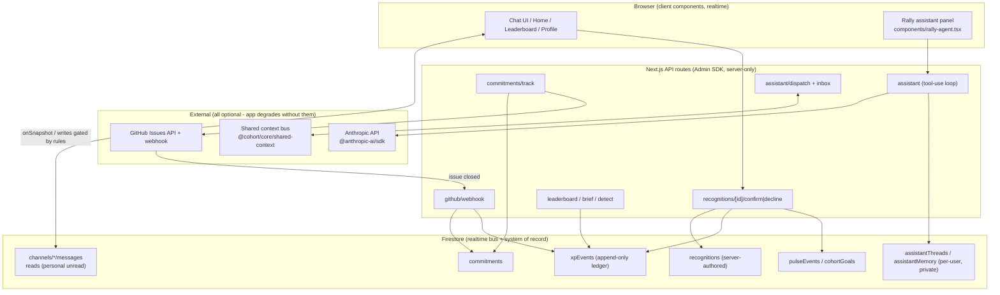
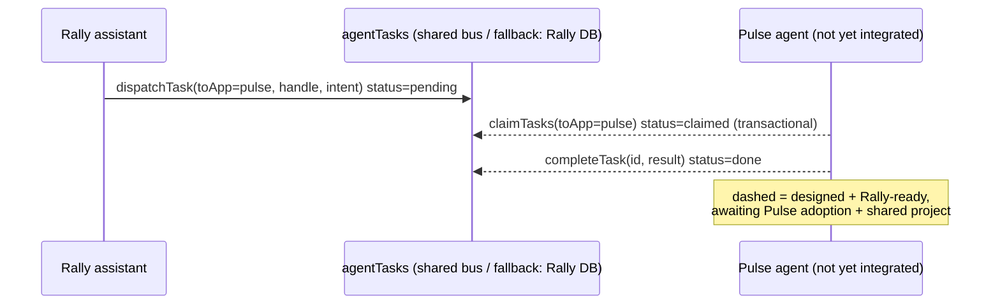

# Rally, Architecture

Rally is a Next.js 16 (App Router) + React 19 + TypeScript app on Firestore, Firebase Auth
(GitHub), and `@anthropic-ai/sdk`. Firestore is the realtime bus (`onSnapshot`, no custom
websockets), Firebase Auth is identity, `firebase-admin` backs the server routes, and the model
runs **server-side only**. This document is grounded in actual files; every claim points at code.

## Design principles (the load-bearing ones)

1. **Core comms works with the smart layer OFF.** Chat, DMs, threads, reactions, and realtime
   must function even if every model call fails and no admin credential exists. Intelligences and
   points-writing routes degrade to no-op (null / 503), never a crash (`AGENTS.md` rule 1).
2. **Ledger, not counters.** XP/rank derive from the append-only `xpEvents` collection, written
   only by admin routes; rank is computed (query + reduce), never a stored total.
3. **The model has no authority.** It classifies, summarizes, drafts. It never writes a
   points-bearing row. Every intelligence has a deterministic fallback (`lib/agent.ts`).
4. **Security lives in `firestore.rules`.** Membership isolation, authorship binding, and the
   anti-gaming guarantees are enforced by rules and proven by the rules test suite.

## Component overview



Client components only ever do what the rules allow: read channels they belong to, post as
themselves, toggle their own reaction, and read their own private threads. Every points-bearing
write happens server-side through the Admin SDK, which bypasses rules by design, so the rules
are free to deny those writes to all clients.

## The trust-ledger data flow (peer-confirmed, ungameable)

This is the core of the product. Recognition is *suggested* (by detection or the assistant),
*confirmed by the helped peer*, and only then does the helper earn points, written atomically to
the append-only ledger. No client can mint, self-award, or double-award.

```mermaid
sequenceDiagram
    autonumber
    participant Helped as Helped member (author)
    participant Msg as Firestore message
    participant Detect as detect / detect-model (server)
    participant Rec as recognitions (server-authored)
    participant Route as confirm route (auth-gated)
    participant Admin as recognition-admin (tx)
    participant XP as xpEvents (append-only)

    Helped->>Msg: "thanks @alice, unblocked me"
    Note over Detect: baseline regex; model layer<br/>falls back to it, output schema-validated
    Detect->>Rec: suggestRecognition() status=suggested, points set by server
    Note over Rec: NO points written yet -<br/>a suggestion is not an award
    Helped->>Route: POST confirm (as the HELPED peer)
    Route->>Admin: confirmRecognition(id, actingUid)
    Note over Admin: guards: helpedUid==actingUid,<br/>helperUid!=actingUid (no self-award),<br/>idempotent on status
    Admin->>XP: xp_help_<id> (helper) + xp_thanks_<id> (confirmer)
    Note over XP: deterministic doc ids ->
    Note over XP: a retry / rules-bypass re-run<br/>awards exactly once
    Admin-->>Route: awarded
    Note over XP: rank = query + reduce over xpEvents,<br/>never a stored total (leaderboard-admin)
```

**Why it cannot be gamed (verified in code):**

- **Clients can never write points.** `firestore.rules`: `xpEvents`, `recognitions`,
  `pulseEvents` are `create/update/delete: false`. Confirming a recognition is a *server-only*
  transaction because flipping status and writing XP must be one atomic act, an earlier version
  that let clients flip status produced "confirmed-but-unawarded" states (`AGENTS.md` rule 5).
- **You cannot award yourself.** `confirmRecognition` rejects `helperUid === actingUid`, and only
  the `helpedUid` can confirm. Detection only ever infers from the author crediting *someone
  else* (`lib/detect.ts`).
- **Counts cannot be inflated.** Deterministic ledger doc ids (`xp_help_<recognitionId>`) make
  awards idempotent; reactions are an inline `{uid: emoji}` map and the rule proves an update
  touches only the caller's own key (`reactionTogglesSelf`); uid-list toggles are set-checked with
  `noDuplicates` + `togglesOnlySelf`.
- **Rank is derived, never stored.** `computeLeaderboard` sums the ledger and ranks in memory,
  returning only the caller's rank, a +/-2 neighbor window, and the cooperative team total, the
  full ordering never leaves the server ("be kind to the quiet").

## The AI layer, no authority, always degradable

`lib/agent.ts` is the single model wrapper. `callClaude` returns text or `null` on missing key or
any failure; `extractJson` parses and **schema-validates** model output before it is trusted.
Three intelligences sit on top, each with a deterministic baseline:

| Intelligence | Model role | Deterministic fallback | Model |
|---|---|---|---|
| Recognition detection | extract gratitude from a message | `detectRecognitions` regex grammar | `claude-sonnet-5` |
| Brief ("catch me up") | classify unread urgency | `buildBrief` ranking | `claude-opus-4-8` |
| Home assistant | tool-use loop over read/draft tools | panel still renders; tools are typed | `claude-sonnet-5` |

**The assistant tool loop** (`lib/assistant-run.ts`) is bounded to `MAX_STEPS = 5`. Tools split
into `SAFE_TOOLS` (read-only or write-to-own-private-memory: `catch_me_up`, `summarize_channel`,
`my_commitments`, `find_teammate`, `remember`) which run server-side, and `PROPOSE_TOOLS`
(`propose_commitment`, `propose_message`, `propose_recognition`, `propose_dispatch`) which
**never execute:** they return a typed `Proposal` the user confirms with one tap. The model
literally has no tool that awards points, posts as the user, or confirms a recognition. A drafted
recognition still goes through peer confirmation. This is the "AI has no authority" guardrail
enforced structurally, not by prompt.

## Commitments -> GitHub issues -> kept

`trackCommitment` (`lib/commitment-admin.ts`) records a commitment and, if a `PmAdapter` is
configured, creates a linked task. The adapter interface (`lib/pm-adapter.ts`) has a GitHub Issues
implementation today; a different PM (Linear, Jira) is a new adapter, not a rewrite. When the
linked issue is **closed**, the signed GitHub webhook (`app/api/github/webhook`, HMAC-verified
over the raw body in `lib/webhook.ts`) calls `completeCommitment`: on-time completion awards XP
once via the ledger and posts a status line back to the source thread. Missing a commitment earns
nothing but is never penalized. With no `GITHUB_TOKEN`/`GITHUB_PM_REPO`, `resolvePmAdapter`
returns null and the commitment is still recorded, just unlinked.

## Cross-app interop (Pulse <-> Rally), how real it is

The shared-context bus is defined once as a pure contract in
`@cohort/core/shared-context` (paths, types, `canTransition` lifecycle) and implemented on the
Rally side in `lib/shared-context.ts` plus the `dispatch` and `inbox` routes. Keyed by **GitHub
handle** (stable across apps; each app has its own Firebase uid), it carries shared memory, an
activity timeline, and `agentTasks` with a `pending -> claimed -> done|failed` lifecycle claimed
transactionally so a task is never worked twice.

**Honest status:** *Rally-side complete; cross-app is a prototype/design.* Rally fully implements
dispatch, inbox (claim + run through its own assistant + report back), shared memory read/write,
and erasure. But **Pulse is not yet integrated** (`docs/SHARED-CONTEXT.md`, "Current state"), and
there is no dedicated shared Firebase project yet, the bus *transparently falls back to Rally's
own database*, so shared context works *within* Rally today and the two-app hand-off is designed
and Rally-ready but not yet exercised end-to-end against a live Pulse agent. It is a credible,
tested contract, not a running two-app demo.



## Data model (Firestore collections)

| Collection | Written by | Client access (rules) |
|---|---|---|
| `profiles/{uid}` | the member | read: cohort; write: self only, uid immutable |
| `channels/{id}` + `/messages` + `/reads/{uid}` | members | read: members; post as self; reactions toggle own key; unread is self-only |
| `recognitions/{id}` | **server only** | read only |
| `xpEvents/{id}` (append-only ledger) | **server only** | read only |
| `pulseEvents`, `cohortGoals`, `badges` | **server only** | read only |
| `commitments/{id}` | author (text) + **server** (pmTaskUrl, points, done) | create/edit own text; cannot forge completion |
| `quests/{id}` | **server** (rewardPts, status) | own progress only |
| `assistantThreads/{uid}`, `assistantMemory/{uid}` | **server only** | read own; write denied |
| `cohortContext/*`, `agentTasks` (shared bus) | trusted app servers | deny-all clients |

## Testing surface

`npm run gate` runs typecheck, lint, and four test layers (~171 cases): **unit** (pure logic),
**rules** (the anti-gaming / membership / privacy guarantees, the load-bearing tests),
**integration** (real client SDK + rules + realtime on the emulator, including an adversarial
"break it" pass and a ~65-user / ~2,100-message perf pass), and **e2e** (signed-in browser
flows). See `EVALS.md` for how this maps onto an eval strategy.
